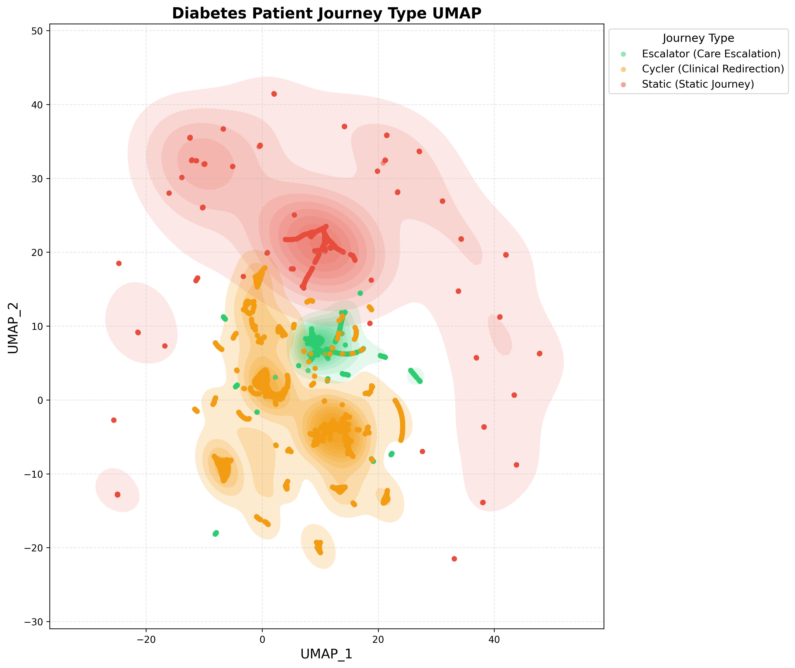
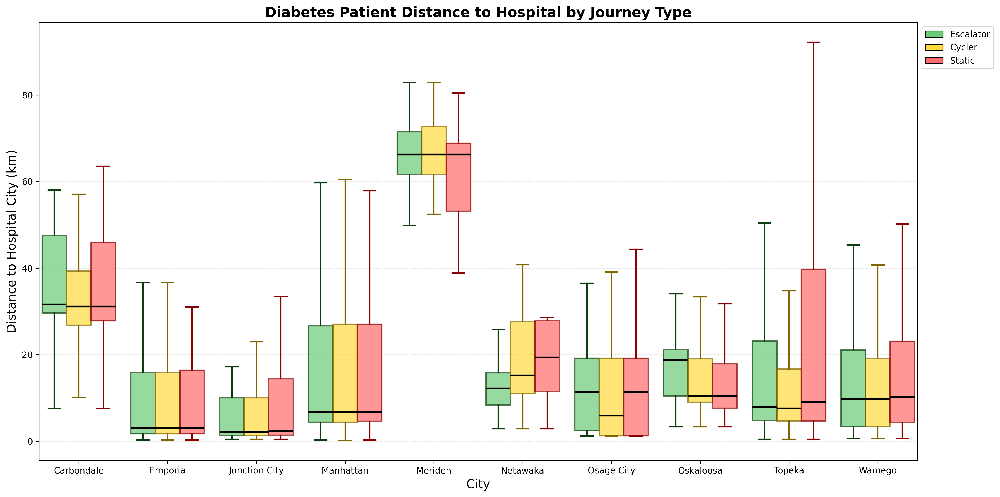

# Datafest 2026 - Healthcare Access Optimization & Patient Journey Analysis

This project analyzes diabetes patient journey types using UMAP (Uniform Manifold Approximation and Projection) for dimensionality reduction and visualization, and optimizes healthcare facility placement using geospatial analysis and greedy maximum coverage algorithms.

## Project Structure

```
Datafest/
├── umap_journey_types.py                 # Main UMAP training and visualization script
├── umap_journey_visualization.py         # UMAP visualization with loose light shading
├── umap_journey_contours.py              # UMAP visualization with contour plots
├── patient_attended_city_distance.py      # Geographic distance analysis by journey type
├── location_optimization.py             # Greedy maximum coverage facility placement
├── placement_model_two_stage.py           # Two-stage regression placement model
├── journey_umap_patients.csv             # Patient features with UMAP coordinates
├── team21_journey_umap.pkl               # Trained UMAP model
├── team21_journey_scaler.pkl             # Feature scaler for UMAP
└── output_journey_umap/                  # Generated outputs (not in git)
```

## Visualizations

### UMAP Patient Journey Types


### Distance to Hospital by Journey Type and City


## Scripts

### umap_journey_types.py
Main script for training UMAP model and generating visualizations.

**Features:**
- Filters diabetes patients (E10, E11, E13, E14 ICD-10 codes)
- Calculates patient journey features (velocity, redundancy, latency, diversity)
- Trains supervised UMAP with journey type labels
- Generates visualization with KDE-based cluster shading
- Saves UMAP model and scaler for reuse

**Usage:**
```bash
python umap_journey_types.py
```

**Outputs:**
- `output_journey_umap/umap_journey_types.png` - UMAP visualization
- `output_journey_umap/journey_umap_patients.csv` - Patient features with UMAP coordinates
- `team21_journey_umap.pkl` - Trained UMAP model
- `team21_journey_scaler.pkl` - Feature scaler

### umap_journey_contours.py
Script for adjusting UMAP visualization parameters without retraining the model.

**Features:**
- Loads existing UMAP data and model
- Adjusts cluster shading parameters (alpha, start_level, bandwidth)
- Updates visualization without re-running UMAP training
- Useful for iterative refinement of visualization appearance

**Usage:**
```bash
python umap_journey_contours.py
```

**Adjustable Parameters:**
- `start_level`: Controls which contour levels to shade (higher = fewer levels shaded)
- `alpha`: Shading transparency (lower = more transparent)
- `bandwidth`: KDE bandwidth for contour smoothing

### umap_journey_visualization.py
Script for creating UMAP visualization with loose light shading effects.

**Features:**
- Loads existing UMAP data from `journey_umap_patients.csv`
- Applies different bandwidths and alpha values per journey type
- Creates refined loose shading for better cluster visibility
- Generates visualization with improved aesthetic parameters

**Usage:**
```bash
python umap_journey_visualization.py
```

### patient_attended_city_distance.py
Script for analyzing geographic distance patterns by patient journey type and hospital city.

**Features:**
- Calculates patient distance to attended hospital city
- Groups patients by journey type and city
- Generates triple box and whisker plots
- Analyzes distance patterns across Stormont Vail Health cities

**Usage:**
```bash
python patient_attended_city_distance.py
```

**Outputs:**
- `geographic_distance_analysis/distance_to_attended_city_boxplot.png` - Box plot visualization
- `geographic_distance_analysis/distance_to_attended_city_stats.csv` - Distance statistics

### location_optimization.py
Script for optimizing healthcare facility placement using greedy maximum coverage algorithm.

**Features:**
- Loads patient and provider locations from census data
- Computes current healthcare coverage
- Implements greedy maximum coverage algorithm
- Identifies optimal locations for new facilities
- Generates interactive geographic coverage map

**Usage:**
```bash
python location_optimization.py
```

**Outputs:**
- `coverage_map.html` - Interactive map showing facility coverage
- Console output with coverage statistics

**Key Parameters:**
- `R`: Coverage radius in km (default: 10 km)
- `K_MAX`: Maximum number of facilities to test (default: 80)
- `TARGET_COVERAGE`: Target coverage percentage (default: 90%)

### placement_model_two_stage.py
Two-stage regression model for healthcare facility placement optimization.

**Features:**
- Stage 1: Logistic regression for probability of hospital usage based on distance
- Stage 2: Linear regression for visits per patient based on distance
- Combined model predicts expected demand: population × probability × visits per patient
- Network expansion approach (adding facilities, not replacing)
- Greedy search for optimal multiple facility locations

**Usage:**
```bash
python placement_model_two_stage.py
```

**Outputs:**
- `optimal_locations_{n}_facilities.csv` - Optimal facility locations
- Console output with investor-friendly summary

## Journey Types

The analysis classifies patients into three journey types:

1. **Abandoned (Static Journey)** - Patients who disengage from care
2. **Cycler (Clinical Redirection)** - Patients who cycle through different care pathways
3. **Escalator (Care Escalation)** - Patients whose care escalates over time

## Visualization Features

- **KDE-based cluster shading** - Transparent shading around clusters using kernel density estimation
- **Color coding** - Red (Abandoned), Yellow (Cycler), Green (Escalator)
- **Legend** - Positioned outside the plot for clarity
- **Axis labels** - UMAP_1 and UMAP_2

## Requirements

- Python 3.7+
- pandas
- numpy
- scikit-learn
- umap-learn
- matplotlib
- seaborn
- scipy
- plotly
- webbrowser

## Installation

```bash
pip install pandas numpy scikit-learn umap-learn matplotlib seaborn scipy plotly
```

## Notes

- The UMAP model is trained on 7,383 diabetes patients
- Random state is set to 42 for reproducibility
- The visualization uses refined shading parameters for optimal cluster visibility
- Facility placement optimization identifies 48 optimal sites to increase coverage from 65.4% to 79.7%
- Geographic distance analysis covers Stormont Vail Health cities across Kansas
- Two-stage regression model quantifies "travel friction" impact on healthcare utilization
